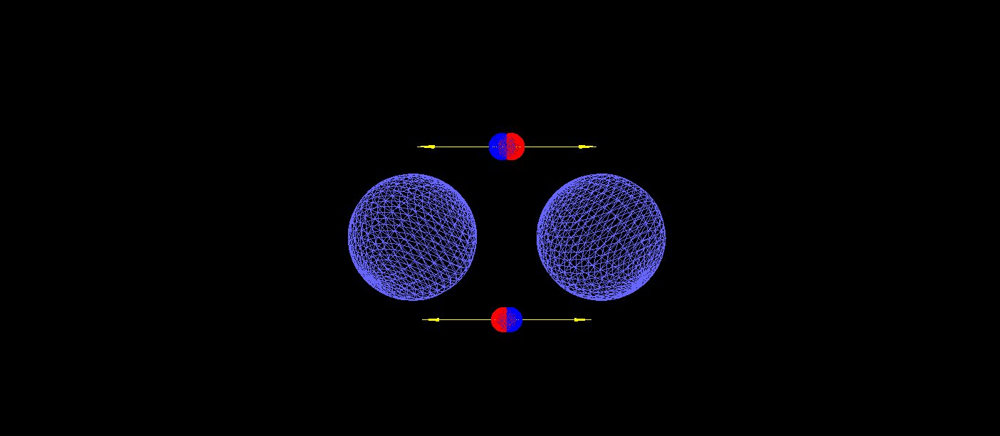
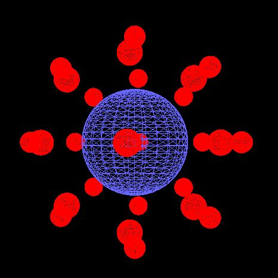
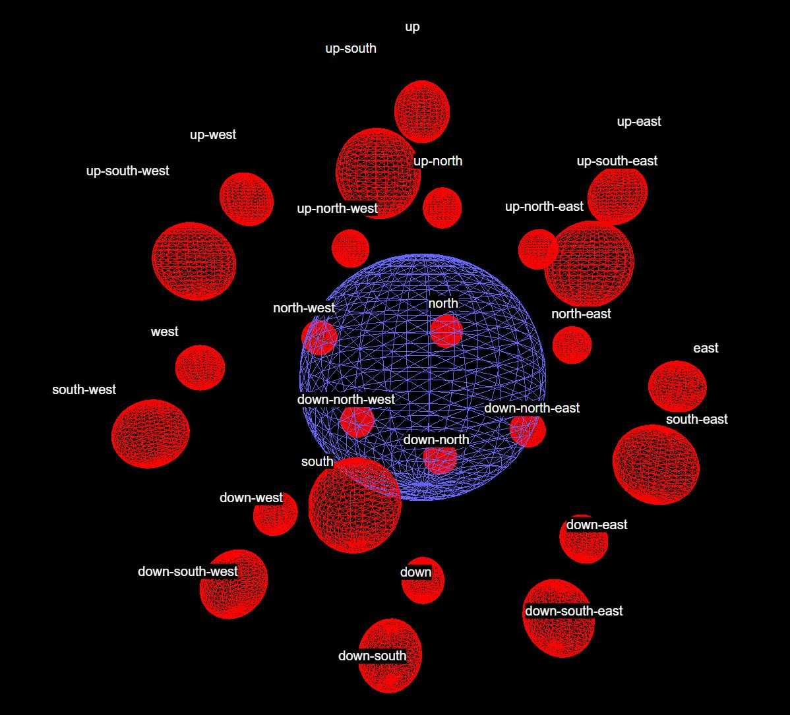

# Altphy (alternative physics) experiment with [three.js](https://threejs.org/)

This repository is just intended to be a playground, an experiment, a prototype.. so it will not be mantained, but it may undergo through changes from time to time.

The code is basically garbage in my opinion.. but it's free for us to play with. Maybe some internal stuff can be learned and exploited from it for building other things in the future.

The idea behind this project is to let creativity flow by inventing rules for these invented particles called Alphatrons, with their little Gammatrons all around them.

Gammatrons are charged positively or negatively and they generate attractive or repulsive forces that will be used by the Alphatrons to compute the movements and rotations (torques) of the Alphatron themselves.

There are some helper classes (called factories) that allow us to build Alphatrons with pre-positioned Gammatrons. If no list of Gammatrons is passed to the AlphaFactory, then all the Gammatron positions will be occupied by positively charged Alphatrons:

The Gammatron standard positions are labeled in such fashion:

## Previous experiment vs current one

I find very difficult at this time to implement a way for the pivots between Gammatrons to work properly. Please note that I'm not using any external physics library and I'm not a physicist.
Pivots are supposed to be created when two Gammatrons are so close to each other that they stick together (at least that is what should happen) as one.

This is the second time I try to build this system, last year I used [ammo js](https://github.com/kripken/ammo.js). The result was fascinating (see the gif below) but I had no much control over it, and interactions were randomly crazy I don't know why.

It's also intentional the choice of not using any THREE.Group in order to build pivots. I want the structure to be hierarchically flat and to use "physics" laws if that makes sense.

## How to run in dev

The project has been built with `Node JS` (v20.10.0) using `yarn`, `typescript` and `vite`.

1- cd into the project
2- run `yarn` to install dependencies
3- run `yarn dev` to run the development environment at `http://localhost:5173/`
